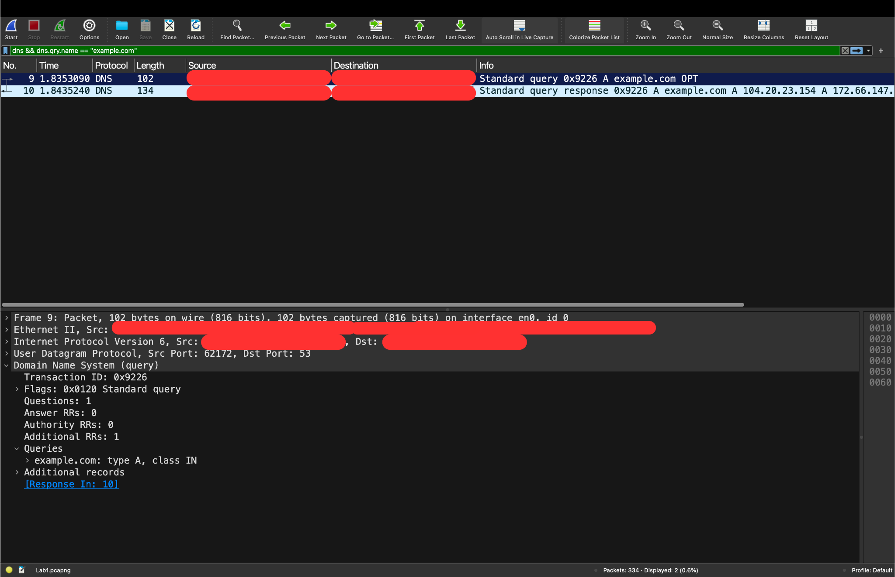
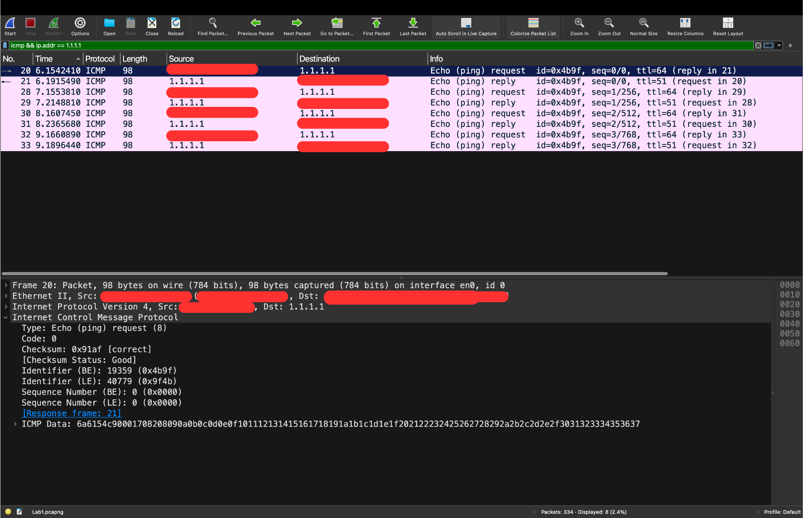
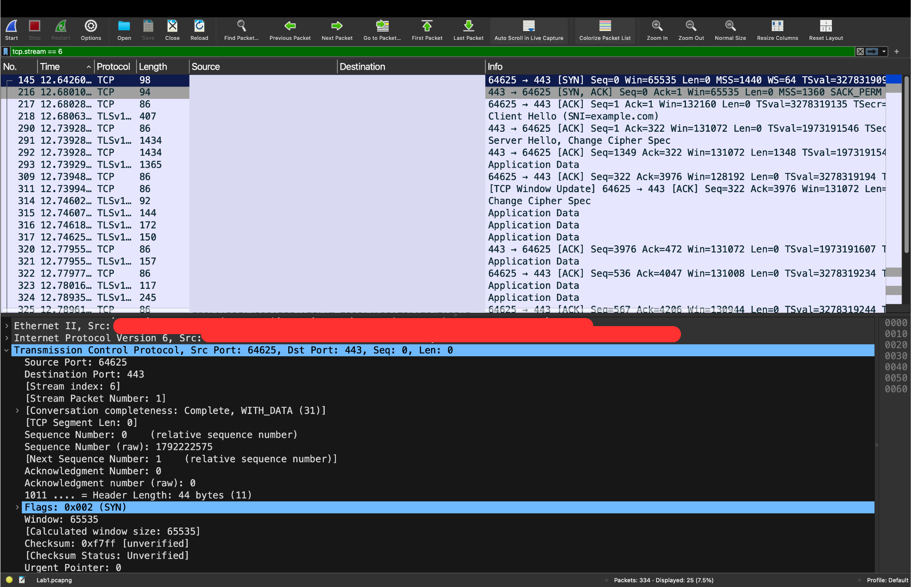
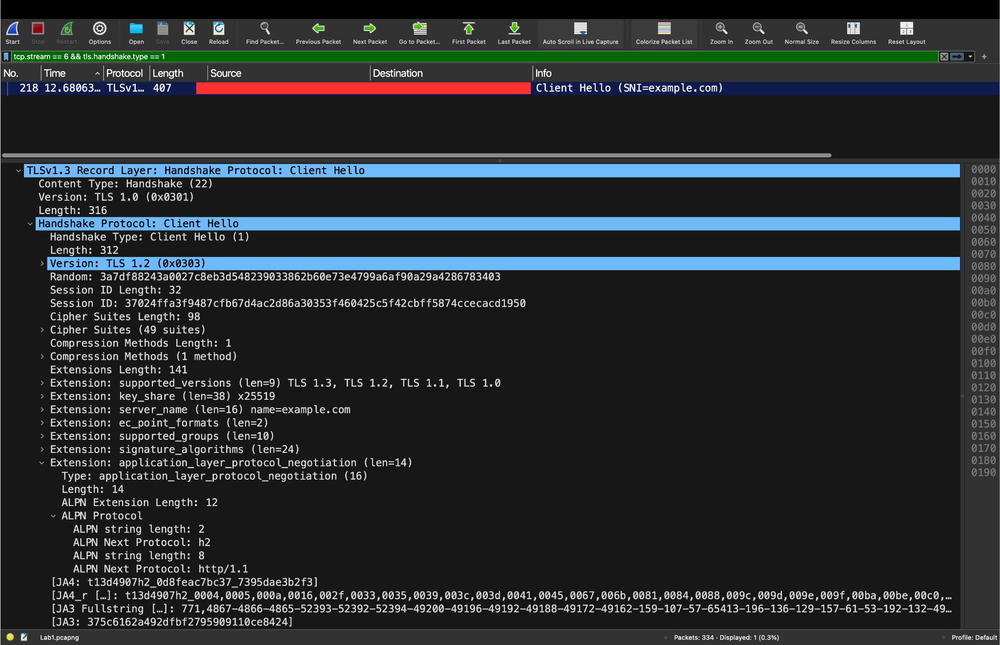
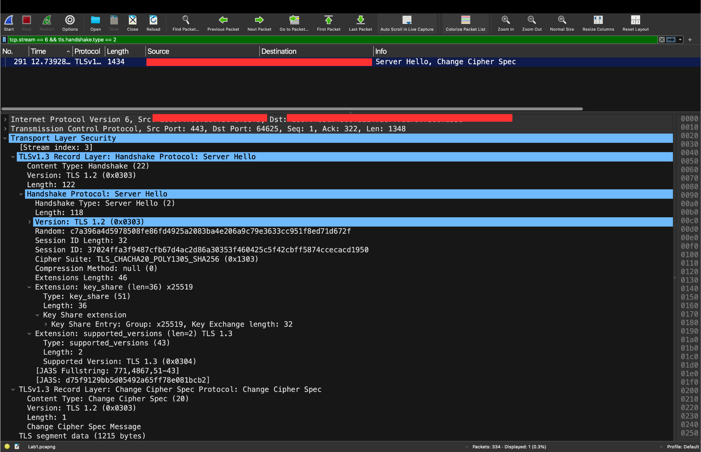

# Wireshark Network Traffic Analysis

## Overview

This project documents a controlled Wireshark investigation of normal DNS,
ICMP, TCP, and TLS traffic. I generated predictable network activity from a
macOS endpoint, isolated the relevant packets from background traffic, and
interpreted protocol behavior across the TCP/IP stack.

The project demonstrates entry-level SOC and network-security skills:

- Capturing traffic from the correct network interface
- Building targeted Wireshark display filters
- Correlating protocol requests with responses
- Isolating a single TCP conversation from background traffic
- Interpreting TCP establishment and TLS negotiation
- Sanitizing packet-capture evidence before publication

## Lab Environment

- **Operating system:** macOS
- **Analyzer:** Wireshark 4.6.2
- **Capture interface:** Wi-Fi (`en0`)
- **Traffic-generation tools:** `dig`, `ping`, and `curl`
- **Targets:** `example.com` and `1.1.1.1`

## Safe Traffic Generation

I closed applications containing sensitive information, captured only normal
traffic on my own endpoint, and generated three controlled exchanges:

```bash
dig example.com
ping -c 4 1.1.1.1
curl -I https://example.com
```

The original capture is not included because it contains unrelated background
traffic and local network identifiers. Published screenshots use opaque
redaction to remove IP and MAC addresses and device/vendor identifiers.

## Findings

### 1. DNS resolution

The DNS filter isolated an A-record query for `example.com` and its matching
response. The shared transaction ID (`0x9226`) correlates the query and response,
while the query details identify the requested name, record type (`A`), and
Internet class (`IN`).



### 2. ICMP reachability

The capture contains four ICMP Echo requests and four matching Echo replies for
`1.1.1.1`. Matching identifiers and sequence numbers correlate each request
with its reply and confirm bidirectional ICMP reachability during the capture.
This does not prove that every TCP or UDP service on the destination was
available.



### 3. TCP connection establishment

I isolated the controlled HTTPS exchange as TCP stream 6. The first three
packets show the expected SYN, SYN-ACK, and ACK sequence between client port
`64625` and server port `443`. Relative sequence and acknowledgment numbers show
that each SYN consumed one position in its endpoint's independent sequence
space.



### 4. TLS Client Hello

The Client Hello identified `example.com` through Server Name Indication (SNI),
offered TLS versions through the `supported_versions` extension, supplied an
X25519 key share, and advertised HTTP/2 (`h2`) and HTTP/1.1 through ALPN. These
values represent options offered by the client, not the final negotiated
settings.



### 5. TLS Server Hello

The Server Hello selected TLS 1.3 through the authoritative
`supported_versions` extension, selected
`TLS_CHACHA20_POLY1305_SHA256`, and returned an X25519 key share. The visible
TLS 1.2 version fields are legacy compatibility values and do not identify the
negotiated version.



After the handshake, Wireshark displayed TLS Application Data in both
directions, confirming that the application exchange was encrypted. The TCP
conversation later ended through a graceful four-packet FIN/ACK closure rather
than an abrupt reset.

## Analyst Takeaways

- A valid TCP handshake alone does not prove that a stream belongs to the
  expected application. I initially isolated background traffic, then used TLS
  SNI to recognize `chatgpt.com` and locate the controlled `example.com` stream.
- A successful ping confirms an ICMP response at that moment; it does not prove
  that an application service is healthy.
- TLS Client Hello fields describe client offers. Server Hello fields confirm
  selected connection parameters.
- Packet captures can expose local identifiers and unrelated traffic, so raw
  captures should be reviewed and minimized before publication.

## Repository Contents

- [`evidence/`](evidence/) — five sanitized Wireshark screenshots
- [`docs/filters.md`](docs/filters.md) — display filters used in the analysis
- [`docs/findings.md`](docs/findings.md) — concise analyst findings and scope

